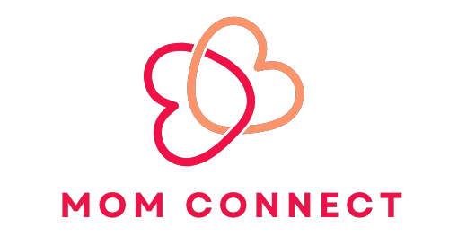
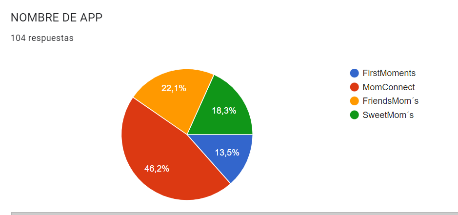
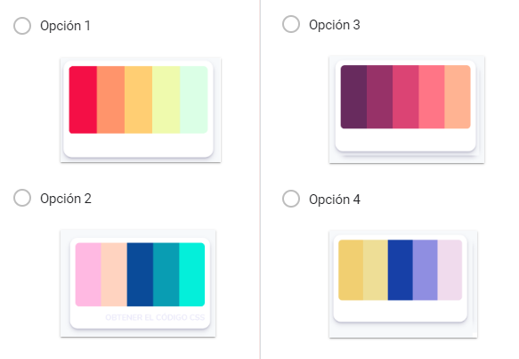
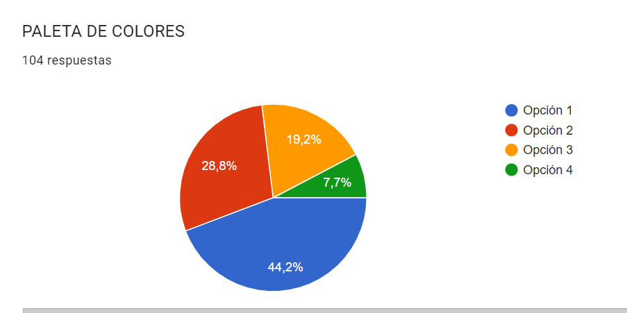
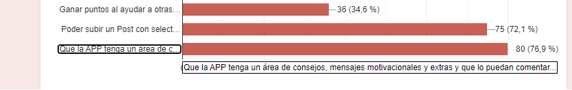
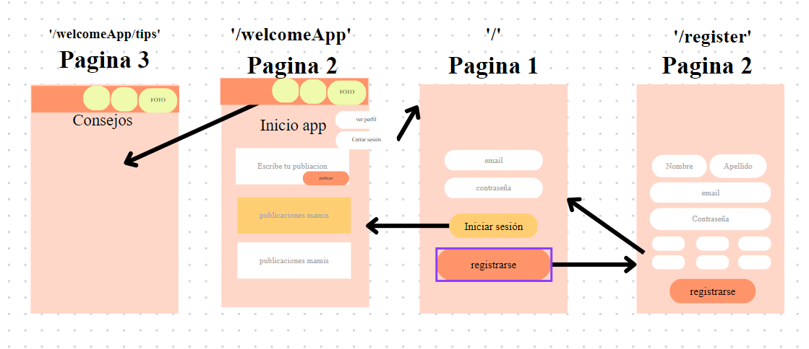
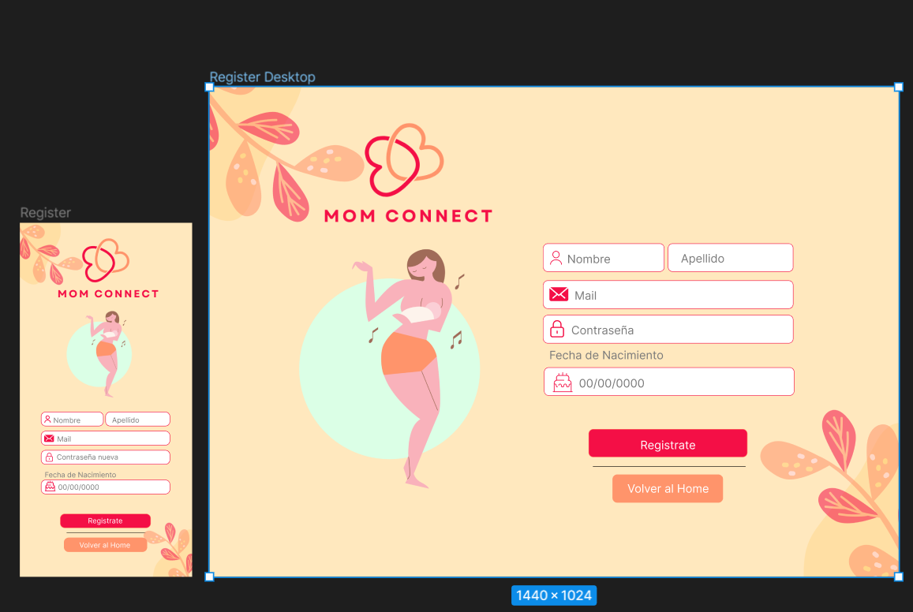
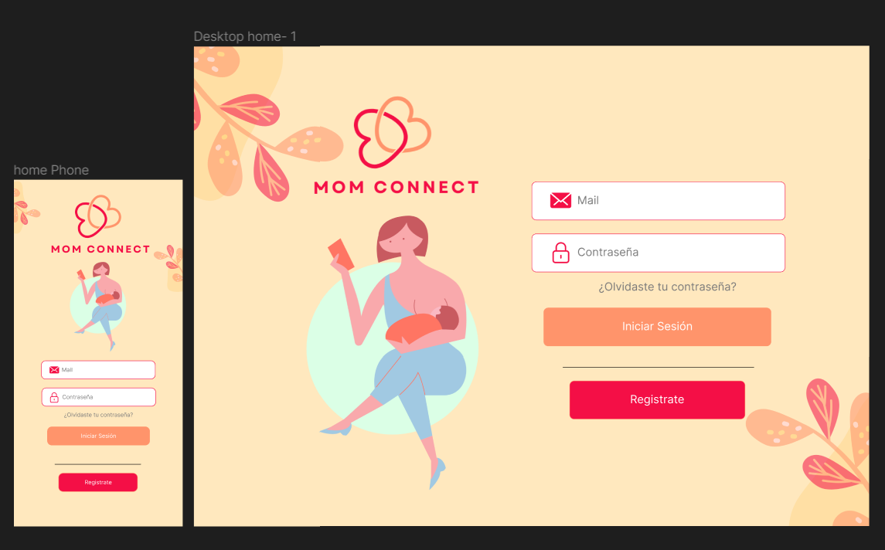
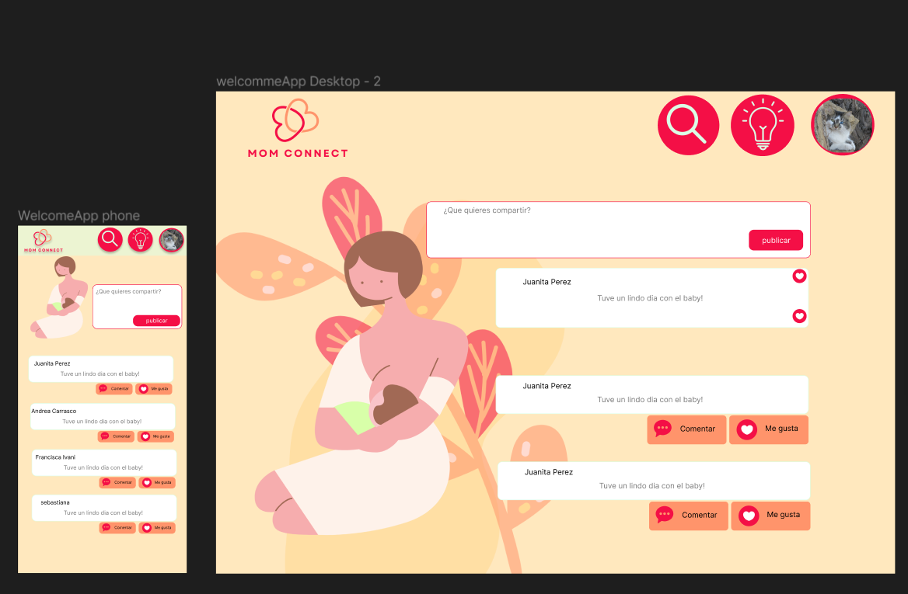

## Índice

* [1. Resumen del proyecto](#1-resumen-del-proyecto)
* [2. Estudio de grupo objetivo](#4-estudio-de-grupo-objetivo)
* [3. Historias de usuario](#3-Historia-de-usuario)
* [4. Prototipo](#4-prototipo)

## 1. Resumen del proyecto

El proyecto realizado tiene como nombre “Mom-Connect”, es una red social para el acompañamiento de madres primerizas, con el objetivo de compartir consejos y ser una red de apoyo en esa etapa de la vida. Cuenta con la página principal Home, con el inicio de sesión y/o registro de usuario. Una vista de bienvenida a la app, con los post de usuarias y un apartado para agregar sus propias publicaciones. Además, tenemos una sección de tips para agregar publicaciones de profesionales de la salud relacionados con la temática.

Revisa nuestro proyecto aqui: [MomConnect](https://momconnect3-9d7fd.firebaseapp.com/tips)

## 2. Estudio de grupo objetivo

Se realizó un formulario con opciones de nombre de aplicación, paleta de colores y funciones principales, para conocer percepción de grupo objetivo y adecuarnos a sus necesidades.

### Se consultó a la población sobre qué nombre se asemejaba más al objetivo de la red social

### También se consultó respecto a qué paleta de colores se les hacía más amigable.

### Por último también quisimos conocer qué funciones les gustaría en la red social

En este punto se observó considerar selectores de temas predeterminados , además de un espacio donde se pudieran compartir tips profesionales. 

## 3. Historias de usuario

### Historia 1: Como usuario quiero poder iniciar sesión en la app
Criterios Mínimos:
* Que pueda escribir su mail y contraseña.
* Que al apretar botón iniciar sesión pueda ingresar a tu cuenta
* Que se verifique si la cuenta y mail debe ser válido
* Verificar usuarios repetidos.
* Lo que se escribe en el campo contraseña debe ser secreto

Definición de terminado:
* Debe ser una SPA.
* Debe ser responsive.
* Deben haber recibido code review de al menos una compañera de otro equipo.
* Realizar los test unitarios
* Testeo manual buscando errores e imperfecciones simples.
* Realizar pruebas de usabilidad e incorporar el feedback de los usuarios como mejoras.
* Desplegaron su aplicación y etiquetaron la versión (git tag).

### Historia 2: Como usuario quiero poder registrarme en la app

Criterios Mínimos:
  validaciones: 
* Solamente se permite el acceso a usuarios con cuentas válidas.
* No pueden haber usuarios repetidos.
* La cuenta de usuario debe ser un correo electrónico válido.
* Lo que se escriba en el campo (input) de contraseña debe ser secreto.
  Comportamiento:
* Al enviarse el formulario de registro o inicio de sesión, debe validarse.
* Si hay errores, se deben mostrar mensajes descriptivos para ayudar al usuario a corregirlos.

Definición de terminado:
* Debe ser una SPA.
* Debe ser responsive.
* Deben haber recibido code review de al menos una compañera de otro equipo.
* Hicieron los test unitarios
* Testeo manualmente buscando errores e imperfecciones simples.
* Realizar pruebas de usabilidad e incorporar el feedback de los usuarios como mejoras.
* Despliegue su aplicación y etiquetaron la versión (git tag).

### Historia 3: Yo como usuario quiero acceder con Google
Criterios Mínimos:
  Validaciones:
* Solamente se permite el acceso a usuarios con cuentas válidas.
* No pueden haber usuarios repetidos.
* La cuenta de usuario debe ser un correo electrónico válido.
* Que el botón cumpla con las especificaciones de google

Definición de terminado:
* Debe ser una SPA.
* Debe ser responsive.
* Deben haber recibido code review de al menos una compañera de otro equipo.
* Realizar los test unitarios
* Testeo manualmente buscando errores e imperfecciones simples.
* Realizar pruebas de usabilidad e incorporar el feedback de los usuarios como mejoras.
* Despliegue su aplicación y etiquetaron la versión (git tag).

### Historia 4: Que en el muro haya una sección de consejos profesionales sobre el tema.

Criterios Mínimos:
  Validaciones:
* Al publicar, se debe validar que exista contenido en el input.
  Comportamiento:
* Al recargar la aplicación, se debe verificar si el usuario está logueado antes de mostrar contenido.
* Poder publicar un post.
* Poder dar y quitar like a una publicación. Máximo uno por usuario.
* Llevar un conteo de los likes.
* Poder eliminar un post específico.
* Pedir confirmación antes de eliminar un post.
* Al dar click para editar un post, se debe cambiar el texto por un input que permite editar el texto y luego guardar los cambios.
* Al guardar los cambios debe cambiar de vuelta a un texto normal pero con la información editada.
* Al recargar la página debo de poder ver los textos editados.
* Que puedan escribir consejos solo profesionales de la salud

Definición de terminado:
* Debe ser una SPA.
* Debe ser responsive.
* Deben haber recibido code review de al menos una compañera de otro equipo.
* Realizar los test unitarios
* Testeo manualmente buscando errores e imperfecciones simples.
* Realizar pruebas de usabilidad e incorporar el feedback de los usuarios como mejoras.
* Despliegue su aplicación y etiquetaron la versión (git tag).

### Historia 5: Como usuario quiero publicar un post.

Criterios Mínimos:
  Validaciones:
* Al publicar, se debe validar que exista contenido en el input.
  Comportamiento:
* Al recargar la aplicación, se debe verificar si el usuario está logueado antes de mostrar contenido.
* Poder seleccionar un hashtag según su tema de publicación mediante un select con opciones.
* Poder publicar un post.

Definición de terminado:
* Debe ser una SPA.
* Debe ser responsive.
* Deben haber recibido code review de al menos una compañera de otro equipo.
* Realizar los test unitarios
* Testeo manualmente buscando errores e imperfecciones simples.
* Realizar pruebas de usabilidad e incorporar el feedback de los usuarios como mejoras.
* Despliegue su aplicación y etiquetaron la versión (git tag).

### Historia 6: Como usuario quiero tener la opción de ver y dar like a otros post.

Criterios Mínimos:
  Comportamiento:
* Al recargar la aplicación, se debe verificar si el usuario está logueado antes de mostrar contenido.
* Poder dar y quitar like a una publicación. Máximo uno por usuario.
* Llevar un conteo de los likes.

Definición de terminado:
* Debe ser una SPA.
* Debe ser responsive.
* Deben haber recibido code review de al menos una compañera de otro equipo.
* Realizar los test unitarios
* Testeo manualmente buscando errores e imperfecciones simples.
* Realizar pruebas de usabilidad e incorporar el feedback de los usuarios como mejoras.
* Despliegue su aplicación y etiquetaron la versión (git tag).

### Historia 7: Como usuario quiero poder eliminar y editar mi post.
Criterios Mínimos:
  Comportamiento:
* Al recargar la aplicación, se debe verificar si el usuario está logueado antes de mostrar contenido.
* Que aparezca un menú desplegable con la opción editar y eliminar, pero sólo a la persona que escribió ese post.
* Poder eliminar un post específico.
* Pedir confirmación antes de eliminar un post.
* Al dar click para editar un post, se debe cambiar el texto por un input que permite editar el texto y luego guardar los cambios.
* Al guardar los cambios debe cambiar de vuelta a un texto normal pero con la información editada.
* Al recargar la página debo de poder ver los textos editados.

Definición de terminado:
* Debe ser una SPA.
* Debe ser responsive.
* Deben haber recibido code review de al menos una compañera de otro equipo.
* Realizar los test unitarios
* Testeo manualmente buscando errores e imperfecciones simples.
* Realizar pruebas de usabilidad e incorporar el feedback de los usuarios como mejoras.
* Despliegue su aplicación y etiquetaron la versión (git tag).

## 4. Prototipos

### 4.1 prototipo de baja fidelidad con su interacción

En nuestro prototipo de baja fidelidad buscamos entender y analizar mejor la interacción que el usuario tendrá con la página

### 4.1 prototipo alta fidelidad

Prototipo página de registro: 

Prototipo página de inicio sesión 

Prototipo página de bienvenida.

## 5. Mejoras para futuro

* Poder crear apartado de perfil con una imagen
* Poder subir imágenes al post. 
* Considerar una barra de búsqueda para filtrar por tema. 

